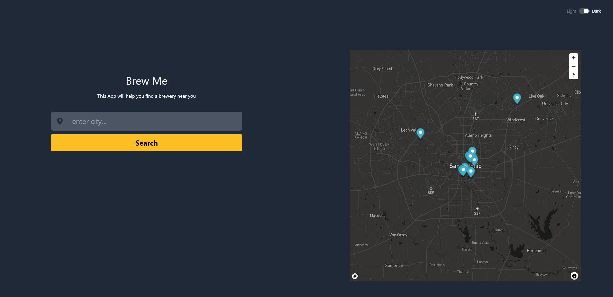

# Brew Me

Team Project 1: (TANNER BRIEGER, FORREST MILLS, TIRSA GOMEZ, JESSE HERNANDEZ)

Group #: 6

Title: Brew Me
An app to locate breweries

USER STORY:
As a user who is thursty and connected to the web
I want to search for breweries in the city
so that I can be thursty no more.

ACCEPTANCE CRITERIA:
GIVEN: I am on brew me super awesome website.

WHEN I "enter city"
THEN I will see "points of interest" (the list of breweries in the city) on map.

WHEN I "click" on the brewery on the map
THEN I will see a pop-up that displays the name of brewery, address, state, and website.

[website link](https://jesseovr.github.io/brew-me/)

First API
https://www.openbrewerydb.org/
Brewery API
Second API
https://docs.mapbox.com/api/navigation/directions/
Mapbox API

Group Roles
Tirsa - UI
Jesse - UI
Tanner - API -1
Forrest - API - 2

"Wishlist" features - have not reached

1.  directions/navigation
2.  travel time
